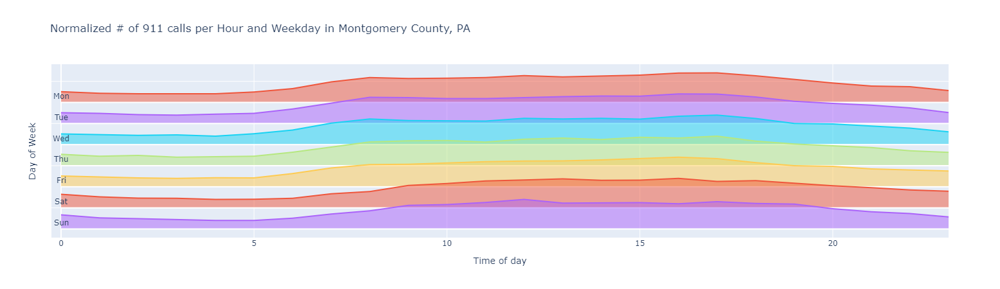

# 911 calls explorer
Interactive data explorer showing the clustering of 911 calls in Motgomery County, PA

## How to run
Simply clone this repo and 'run all' in your Jupyter Notebook

## Heatmap

## Clustermap

## Interactive Ridgemap

## Dataset
Dataset from Emergency (911) Calls: Fire, Traffic, EMS for Montgomery County, PA [Kaggle](https://www.kaggle.com/mchirico/montcoalert)

## Libraries

| Name | Library |
| ------ | ------ |
| Pandas | https://pandas.pydata.org/ |
| Matplotlib | https://matplotlib.org/ |
| Seaborn | https://seaborn.pydata.org/ |
